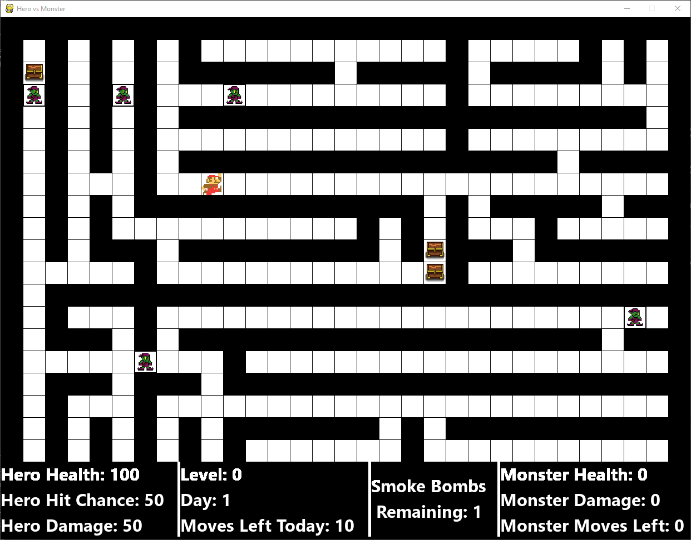
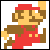
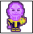
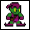
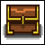

# Hero vs Monster Game
<h4>DISCLAMER  - I DON'T OWN ANY OF THE ARTWORK USED IN THIS MINI-GAME</h4>
<h4><u>Windows only</u></h4>
<h2>Rules of the game</h2>

<h3>The Grid & Status Panel</h3>

***

The main game grid consists of 'Blocks' arranged in a 17 x 17 square

The size of these blocks changes depending on the window size, which in is dependent on the screen size

The Status Panel is located under the grid and contains useful information including how many moves the hero has left, the hero's health, current level etc.

On the grid along with the Hero, there is Goblins, Chests, and the Monster

***

<h3>Hero</h3>

***

You control the Hero around the maze. When the Hero lands on a block with a Goblin or Chest an interaction scene is displayed which requires you to make some sort of choice. These have an impact on the game so look out for these!

The Hero is displayed on the grid as:

***

  <h3>Monster</h3>
  
  ***
  
The 1st Monster will spawn into the game after the Hero has used the inital 10 moves. 
  The Monster gets 6 moves per day opposed to the hero's 2. The Monster also moves 1st each day - beginning on day 3.

  
A battle between the Monster can be initiated on either the Monsters move or the Hero's move.

  
  <h4>The battle</h4>
  
The battle is a turn based startegy scenario in which the Hero gets the 1st move. The Hero has got 3 options:

  <ol><li>Light Attack - Lower damage but higher hit chance</li>
  <li>Heavy Attack - Higher damage but lower hit chance</li>
  <li>Smoke bomb escape (is hero has any) - Escape the battle with a head start of 6 bonus moves</li></ol>
  
After the Hero has made a choice the Monster will deal damage to the Hero. This damage has the chance to be a critical hit so be mindful of your health.

  
If the Hero beats the Monster, 3 Goblins and a Chest will spawn onto the grid! So look out for these.

  
  
The Monster is displayed on the grid as:

  
  
  ***

<h3>Goblins</h3>

***

There are 3 types of Goblins:

<ol><li>Health Goblins - Give the Hero health is the Hero makes a wise choice in the Odd & Even game</li>
<li>Smoke Goblins - Gives the Hero an extra smoke bomb if the Hero wins a game of Rock Paper Scissors</li>
<li>Choice Goblins - Lets the Hero choose which type of Goblin to meet</li></ol>

Goblins are displayed on the grid as:

***

<h3>Chests</h3>

***

Chests are the <b>most useful</b> things on the grid to interact with, they give the Hero a choice between getting 
more damage or a higher hit chance <u>(This cannot be higher than 100 so don't waste chests)</u>

Chests are displayed on the grid as:

***

<h3>Game Over</h3>

***

When the Hero is defeated by the Monster the Game Over screen will appear.

A local leaderboard will appear with the highest levels achieved.

If your level is high enough to be added to the leaderboard you will be asked to input your name into a form.

